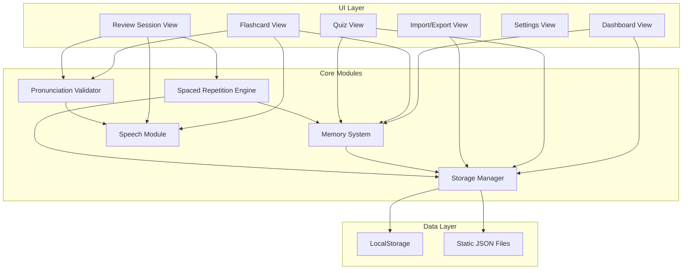
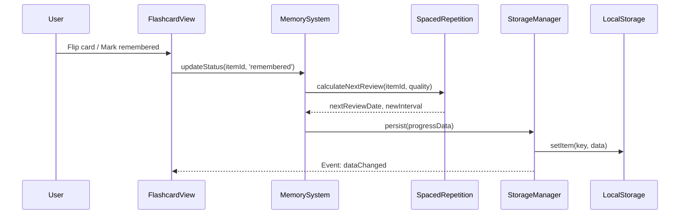
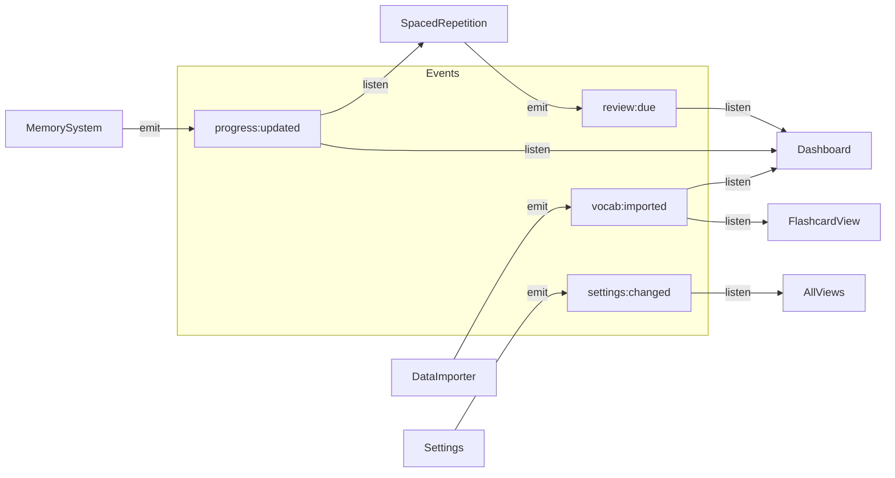
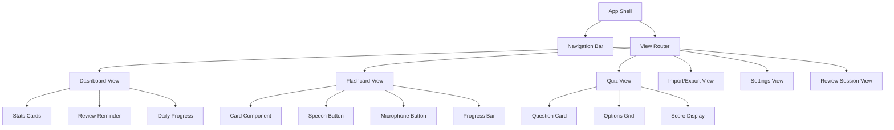

# Technical Design Document: English Vocabulary App

## Overview

Ứng dụng học từ vựng tiếng Anh chạy hoàn toàn trên trình duyệt (client-side), không cần backend. Ứng dụng sử dụng kiến trúc module-based với Vanilla HTML/CSS/JavaScript, lưu trữ dữ liệu trên LocalStorage và static JSON files. Giao diện tiếng Việt, responsive, dark mode, tích hợp Web Speech API cho phát âm và nhận diện giọng nói.

### Key Design Decisions

1. **Vanilla JS với ES Modules** thay vì React — phù hợp hơn cho ứng dụng nhỏ, không cần build tool phức tạp, dễ chạy local
2. **Event-driven architecture** — các module giao tiếp qua custom events, loose coupling
3. **SM-2 algorithm** cho spaced repetition — thuật toán đã được kiểm chứng, đơn giản để implement
4. **Static JSON bundled** — dữ liệu từ vựng pre-generated được bundle cùng app, load một lần vào LocalStorage

## Architecture

### High-Level Architecture



### Module Communication



### File Structure

```
english-vocabulary-app/
├── index.html
├── css/
│   ├── main.css
│   ├── themes.css          # Light/dark mode variables
│   ├── flashcard.css       # Flashcard flip animations
│   └── responsive.css      # Media queries
├── js/
│   ├── app.js              # Entry point, router
│   ├── modules/
│   │   ├── storage-manager.js
│   │   ├── memory-system.js
│   │   ├── spaced-repetition.js
│   │   ├── speech-module.js
│   │   ├── pronunciation-validator.js
│   │   ├── data-importer.js
│   │   └── quiz-engine.js
│   ├── views/
│   │   ├── dashboard-view.js
│   │   ├── flashcard-view.js
│   │   ├── quiz-view.js
│   │   ├── import-view.js
│   │   ├── review-view.js
│   │   └── settings-view.js
│   └── utils/
│       ├── event-bus.js     # Custom event system
│       └── helpers.js
├── data/
│   ├── vocabulary-3000.json
│   └── vocabulary-a1-a2.json
└── assets/
    └── icons/
```

## Components and Interfaces

### Core Module Interfaces

#### StorageManager

```javascript
class StorageManager {
  // Vocabulary data
  getAllVocabulary(): VocabularyItem[]
  getVocabularyByCategory(category: string): VocabularyItem[]
  saveVocabulary(items: VocabularyItem[]): void
  
  // Progress data
  getProgress(itemId: string): ProgressRecord
  getAllProgress(): Map<string, ProgressRecord>
  saveProgress(itemId: string, progress: ProgressRecord): void
  
  // Bulk operations
  exportAllData(): ExportData
  importData(data: ExportData): ImportResult
  
  // Settings
  getSettings(): AppSettings
  saveSettings(settings: AppSettings): void
  
  // First-run detection
  isFirstRun(): boolean
  loadPreGeneratedData(): Promise<void>
}
```

#### MemorySystem

```javascript
class MemorySystem {
  // Status management
  markRemembered(itemId: string): void
  markNotRemembered(itemId: string): void
  getStatus(itemId: string): LearningStatus
  
  // Statistics
  getStats(): LearningStats
  getDailyProgress(): DailyStats
  
  // Word selection
  getWordsForStudy(count: number): VocabularyItem[]
  getWordsForReview(): VocabularyItem[]
  getDailyWords(date: string): VocabularyItem[]
  
  // Pronunciation tracking
  recordPronunciationAttempt(itemId: string, success: boolean): void
  isPronunciationPassed(itemId: string): boolean
  canMarkAsCompleted(itemId: string): boolean
}
```

#### SpacedRepetitionEngine

```javascript
class SpacedRepetitionEngine {
  // SM-2 algorithm implementation
  calculateNextReview(itemId: string, quality: number): ReviewSchedule
  getItemsDueForReview(date?: Date): VocabularyItem[]
  getReviewSchedule(): ReviewScheduleMap
  
  // Interval management
  resetInterval(itemId: string): void
  increaseInterval(itemId: string): void
}
```

#### SpeechModule

```javascript
class SpeechModule {
  // Text-to-Speech
  speak(word: string, accent?: 'en-US' | 'en-GB'): Promise<void>
  setAccent(accent: 'en-US' | 'en-GB'): void
  getAvailableVoices(): SpeechSynthesisVoice[]
  
  // Speech Recognition
  startRecognition(): Promise<string>
  stopRecognition(): void
  isRecognitionSupported(): boolean
}
```

#### PronunciationValidator

```javascript
class PronunciationValidator {
  // Validation
  validate(targetWord: string, recognizedText: string): ValidationResult
  startValidation(targetWord: string): Promise<ValidationResult>
  
  // History
  getAttemptCount(itemId: string): number
  getFirstSuccessDate(itemId: string): Date | null
}
```

#### QuizEngine

```javascript
class QuizEngine {
  // Quiz generation
  generateQuiz(type: QuizType, count: number): QuizQuestion[]
  generateDistractors(correctItem: VocabularyItem, count: number): string[]
  
  // Session management
  startSession(type: QuizType): QuizSession
  submitAnswer(questionId: string, answer: string): AnswerResult
  endSession(): QuizResult
}
```

#### DataImporter

```javascript
class DataImporter {
  // File parsing
  parseCSV(content: string): ImportResult
  parseJSON(content: string): ImportResult
  parseTXT(content: string): ImportResult
  
  // Validation
  validateItem(item: object): ValidationError[]
  
  // Import
  importFile(file: File): Promise<ImportResult>
}
```


## Data Models

### VocabularyItem

```javascript
/**
 * Core vocabulary item - represents a single word entry
 */
{
  id: string,              // Unique identifier (generated: category_index)
  word: string,            // English word
  meaning: string,         // Vietnamese meaning
  examples: string[],      // Example sentences (1-3)
  pronunciation: string?,  // IPA pronunciation (optional)
  memoryTip: string?,      // Mẹo ghi nhớ (optional)
  category: string,        // Category/level (e.g., "A1", "A2", "3000-essential")
  groupIndex: number       // Index within category for daily session grouping
}
```

### ProgressRecord

```javascript
/**
 * Learning progress for a single vocabulary item
 */
{
  itemId: string,
  status: 'not_studied' | 'remembered' | 'not_remembered',
  
  // Spaced Repetition (SM-2) fields
  easeFactor: number,       // Default: 2.5, min: 1.3
  interval: number,         // Days until next review
  repetitions: number,      // Consecutive correct recalls
  nextReviewDate: string,   // ISO date string
  lastReviewDate: string?,  // ISO date string
  
  // Pronunciation tracking
  pronunciationAttempts: number,
  firstSuccessDate: string?,  // ISO date string
  lastPronunciationDate: string?,
  pronunciationPassed: boolean,
  
  // Completion tracking
  meaningViewed: boolean,
  pronunciationListened: boolean,
  
  // Daily session
  assignedDay: string?,     // ISO date string for daily session assignment
  
  // Timestamps
  createdAt: string,
  updatedAt: string
}
```

### AppSettings

```javascript
{
  theme: 'light' | 'dark',
  accent: 'en-US' | 'en-GB',
  dailyWordCount: number,    // Default: 10
  autoPlayPronunciation: boolean
}
```

### QuizQuestion

```javascript
{
  id: string,
  type: 'meaning_to_word' | 'word_to_meaning',
  prompt: string,           // The question text
  correctAnswer: string,    // The correct option
  options: string[],        // 4 options (including correct)
  targetItemId: string      // Reference to VocabularyItem
}
```

### QuizSession / QuizResult

```javascript
// Session state
{
  id: string,
  type: QuizType,
  questions: QuizQuestion[],
  currentIndex: number,
  answers: { questionId: string, selected: string, correct: boolean }[],
  startedAt: string
}

// Result
{
  totalQuestions: number,
  correctAnswers: number,
  percentage: number,
  completedAt: string
}
```

### ReviewSchedule (SM-2 derived)

```javascript
{
  itemId: string,
  nextReviewDate: string,
  interval: number,         // Days
  easeFactor: number
}
```

### ExportData

```javascript
{
  version: string,          // Schema version for compatibility
  exportedAt: string,
  vocabulary: VocabularyItem[],
  progress: ProgressRecord[],
  settings: AppSettings
}
```

### ImportResult

```javascript
{
  success: boolean,
  importedCount: number,
  errors: { line: number, message: string }[],
  warnings: string[]
}
```

### ValidationResult (Pronunciation)

```javascript
{
  passed: boolean,
  targetWord: string,
  recognizedText: string,
  confidence: number?       // If available from Speech API
}
```

### Static JSON File Format (Pre-Generated Data)

```json
{
  "metadata": {
    "source": "3000.pdf",
    "generatedAt": "2024-01-01",
    "totalItems": 3000,
    "categories": ["essential-3000"]
  },
  "items": [
    {
      "id": "essential-3000_0001",
      "word": "abandon",
      "meaning": "từ bỏ, bỏ rơi",
      "examples": [
        "They abandoned the car in the snow.",
        "She abandoned her dream of becoming an actress.",
        "The building was abandoned years ago."
      ],
      "pronunciation": "/əˈbændən/",
      "memoryTip": "a-BAN-don: BAN (cấm) + don (làm) → cấm không làm nữa → từ bỏ",
      "category": "essential-3000",
      "groupIndex": 1
    }
  ]
}
```

### LocalStorage Key Schema

| Key | Value Type | Description |
|-----|-----------|-------------|
| `vocab_items` | JSON string | All vocabulary items array |
| `vocab_progress` | JSON string | Map of itemId → ProgressRecord |
| `app_settings` | JSON string | AppSettings object |
| `daily_sessions` | JSON string | Map of date → itemId[] |
| `data_loaded` | boolean string | First-run flag for pre-generated data |

### Spaced Repetition Algorithm (SM-2)

The app implements a simplified SM-2 algorithm:

```
Input: quality (0-5 scale, mapped from user actions)
  - "Đã nhớ" (remembered) → quality = 4
  - "Chưa nhớ" (not remembered) → quality = 1

Algorithm:
  if quality >= 3 (correct recall):
    if repetitions == 0: interval = 1
    elif repetitions == 1: interval = 6
    else: interval = round(interval * easeFactor)
    repetitions += 1
  else (incorrect):
    repetitions = 0
    interval = 1

  // Update ease factor
  easeFactor = max(1.3, easeFactor + 0.1 - (5 - quality) * (0.08 + (5 - quality) * 0.02))
  
  nextReviewDate = today + interval days
```

### Module Interaction Patterns



All modules communicate through an EventBus (pub/sub pattern). This keeps modules decoupled — each module only knows about the events it emits and listens to, not about other modules directly.

### Storage Strategy

1. **Initial Load**: On first visit, app loads static JSON files from `/data/` directory into LocalStorage
2. **Subsequent Visits**: All data served from LocalStorage (no network needed)
3. **Data Changes**: Every mutation (import, status update, settings) writes immediately to LocalStorage
4. **Export/Import**: Full data export as downloadable JSON; import replaces or merges existing data
5. **Size Management**: LocalStorage limit ~5-10MB; vocabulary data estimated at ~2-3MB for 4000 words

### UI Component Structure




## Correctness Properties

*A property is a characteristic or behavior that should hold true across all valid executions of a system — essentially, a formal statement about what the system should do. Properties serve as the bridge between human-readable specifications and machine-verifiable correctness guarantees.*

### Property 1: Data Import Round-Trip

*For any* valid set of VocabularyItems, serializing them to CSV, JSON, or TXT format and then parsing back with the DataImporter SHALL produce an equivalent set of VocabularyItems (preserving word, meaning, examples, and pronunciation where present).

**Validates: Requirements 1.1, 1.2, 1.3, 1.6**

### Property 2: Invalid Import Never Corrupts State

*For any* malformed input string (not valid CSV/JSON/TXT vocabulary format), the DataImporter SHALL return an ImportResult with `success=false` and a non-empty errors array, without throwing an exception. Furthermore, *for any* existing vocabulary state and any invalid import data, attempting to import SHALL leave the existing state completely unchanged.

**Validates: Requirements 1.4, 12.3**

### Property 3: Quiz Question Structure Invariant

*For any* vocabulary list of 4 or more items and any generated quiz question, the question SHALL have exactly 4 options, exactly 1 of which is the correct answer, and the correct answer SHALL correspond to a valid VocabularyItem in the source list.

**Validates: Requirements 3.3, 3.1**

### Property 4: Quiz Scoring Consistency

*For any* sequence of quiz answers, the reported score SHALL equal the count of correct answers, and the percentage SHALL equal `(correctCount / totalQuestions) * 100`.

**Validates: Requirements 3.5, 3.6**

### Property 5: Memory Status Invariant

*For any* VocabularyItem and any sequence of markRemembered/markNotRemembered operations, the item's status SHALL always be one of exactly three values: 'not_studied', 'remembered', or 'not_remembered'. After markRemembered, status SHALL be 'remembered'. After markNotRemembered, status SHALL be 'not_remembered'.

**Validates: Requirements 5.1, 2.4, 2.5**

### Property 6: Statistics Internal Consistency

*For any* set of VocabularyItems with associated progress records, the computed statistics SHALL satisfy: `total = studied + notStudied`, `studied = remembered + notRemembered`, and `progressPercentage = (remembered / total) * 100`.

**Validates: Requirements 5.2, 6.3**

### Property 7: Study Prioritization Bias

*For any* vocabulary set containing both remembered and not-remembered items, when sampling words for study over many iterations, not-remembered items SHALL appear with strictly higher frequency than remembered items.

**Validates: Requirements 5.3**

### Property 8: LocalStorage Persistence Round-Trip

*For any* valid vocabulary data set and progress records, saving to LocalStorage via StorageManager and then restoring SHALL produce data equivalent to the original.

**Validates: Requirements 7.1, 7.2**

### Property 9: Daily Session Non-Overlap

*For any* vocabulary set and any sequence of daily session assignments, each VocabularyItem SHALL be assigned to at most one daily session. Daily sessions SHALL contain at most `dailyWordCount` items (default 10).

**Validates: Requirements 10.1, 10.3, 14.4**

### Property 10: SM-2 Algorithm Correctness

*For any* ProgressRecord with repetitions > 0 and interval > 0, marking the item as remembered (quality ≥ 3) SHALL produce a new interval strictly greater than the current interval. The easeFactor SHALL never go below 1.3.

**Validates: Requirements 11.1, 11.2**

### Property 11: SM-2 Reset on Failure

*For any* ProgressRecord regardless of current interval or repetitions, marking the item as not-remembered (quality < 3) SHALL reset repetitions to 0 and interval to 1.

**Validates: Requirements 11.3**

### Property 12: Review Due Date Filtering

*For any* set of VocabularyItems with various nextReviewDates, `getItemsDueForReview(date)` SHALL return exactly those items where `nextReviewDate <= date`, and no others.

**Validates: Requirements 11.4**

### Property 13: Export/Import Round-Trip

*For any* complete app state (vocabulary, progress, settings), exporting to JSON and then importing the resulting file SHALL produce a state equivalent to the original.

**Validates: Requirements 12.1, 12.2**

### Property 14: Pronunciation Validation Case-Insensitivity

*For any* target word and recognized text that differ only in letter casing, the PronunciationValidator SHALL return `passed: true`. *For any* target word and recognized text that differ in actual characters (after case normalization), the validator SHALL return `passed: false`.

**Validates: Requirements 15.3, 15.4, 15.5**

### Property 15: Completion Gate Logic

*For any* VocabularyItem, `canMarkAsCompleted` SHALL return `true` if and only if all three conditions are met: `meaningViewed == true`, `pronunciationListened == true`, AND `pronunciationPassed == true`. Any other combination SHALL return `false`.

**Validates: Requirements 15.7**

## Error Handling

### Error Categories and Strategies

| Category | Scenario | Handling |
|----------|----------|----------|
| Import Errors | Malformed file content | Return ImportResult with descriptive Vietnamese error messages, don't modify existing data |
| Storage Errors | LocalStorage full (QuotaExceededError) | Show warning in Vietnamese, suggest data export before continuing |
| Speech API Errors | Browser doesn't support SpeechSynthesis | Show fallback message, disable pronunciation features gracefully |
| Recognition Errors | Browser doesn't support SpeechRecognition | Show fallback message, allow manual "skip pronunciation" option |
| Data Integrity | Corrupted LocalStorage data | Attempt JSON.parse with try/catch, offer to reset to pre-generated data |
| File Format | Unsupported file type uploaded | Display Vietnamese error: "Chỉ hỗ trợ file CSV, JSON, hoặc TXT" |

### Error Display Pattern

All user-facing errors are displayed in Vietnamese using a non-blocking notification system (toast/banner):

```javascript
// Error notification pattern
showError(message: string, duration?: number): void
showWarning(message: string, duration?: number): void
showSuccess(message: string, duration?: number): void
```

### Graceful Degradation

- If Web Speech API is unavailable: pronunciation features hidden, items can still be marked complete without pronunciation step
- If LocalStorage is full: app continues working in-memory, prompts user to export/clear data
- If pre-generated JSON fails to load: app still works with manual import only

## Testing Strategy

### Property-Based Testing

**Library:** fast-check (JavaScript property-based testing library)

**Configuration:**
- Minimum 100 iterations per property test
- Each test tagged with: `Feature: english-vocabulary-app, Property {number}: {title}`

**Properties to implement (15 total):**
Each correctness property from the section above will have a corresponding fast-check property test. Key generators needed:

- `arbitraryVocabularyItem()` — generates random VocabularyItems with valid fields
- `arbitraryProgressRecord()` — generates random progress states
- `arbitraryQuizAnswerSequence()` — generates random correct/incorrect answer lists
- `arbitraryAppState()` — generates full app state for round-trip tests

### Unit Tests (Example-Based)

Focus areas:
- UI component rendering (flashcard displays correct content)
- Event handling (button clicks trigger correct actions)
- Edge cases: empty vocabulary list, single item quiz generation, zero progress
- Vietnamese text display verification
- Dark mode toggle state

### Integration Tests

- DataImporter → StorageManager pipeline
- MemorySystem → SpacedRepetitionEngine → StorageManager flow
- Speech API mock integration
- First-run data loading sequence

### Test File Structure

```
tests/
├── properties/
│   ├── data-import.property.test.js
│   ├── quiz-engine.property.test.js
│   ├── memory-system.property.test.js
│   ├── spaced-repetition.property.test.js
│   ├── storage-manager.property.test.js
│   ├── pronunciation.property.test.js
│   └── daily-session.property.test.js
├── unit/
│   ├── flashcard-view.test.js
│   ├── quiz-view.test.js
│   ├── dashboard-view.test.js
│   └── speech-module.test.js
└── integration/
    ├── import-flow.test.js
    ├── study-flow.test.js
    └── first-run.test.js
```
